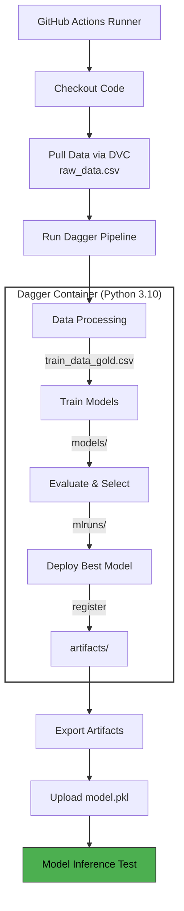

# MLOps Lead Prediction Pipeline

A containerized machine learning pipeline for predicting lead conversion using Dagger, Docker, and GitHub Actions. This project demonstrates modern MLOps practices including automated CI/CD, model versioning with MLflow, and data version control with DVC.

## Table of Contents
- [Project Overview](#project-overview)
- [Architecture](#architecture)
- [Project Structure](#project-structure)
- [Pipeline Stages](#pipeline-stages)
- [Getting Started](#getting-started)
- [GitHub Actions Workflow](#github-actions-workflow)
- [Local Development](#local-development)
- [Model Artifacts](#model-artifacts)
- [Data Management](#data-management)

## Project Overview

This project implements an end-to-end machine learning pipeline that:
- Processes raw lead data with automated preprocessing
- Trains multiple models (XGBoost, Logistic Regression) using grid search
- Evaluates model performance with MLflow tracking
- Automatically deploys the best performing model
- Validates trained models using automated inference tests
- Runs entirely in containerized environments for reproducibility

**Key Features:**
- Fully containerized pipeline using Dagger
- Automated CI/CD with GitHub Actions
- Data versioning with DVC
- Model tracking and registry with MLflow
- Automated model validation
- Reproducible builds with Docker

## Architecture

The pipeline follows a modular architecture with clear separation of concerns:




## Project Structure

```
MLOps_2025_Project/
├── .github/
│   └── workflows/
│       └── dagger.yml              # GitHub Actions CI/CD workflow
├── src/
│   ├── data/
│   │   ├── data.py                 # Data preprocessing pipeline
│   │   ├── raw_data.csv            # Raw input data (pulled via DVC)
│   │   └── raw_data.csv.dvc        # DVC pointer file
│   ├── models/
│   │   ├── train.py                # Model training (XGBoost, LogReg)
│   │   ├── evaluate.py             # Model evaluation & selection
│   │   └── Deploy.py               # Model registration & deployment
│   └── utils.py                    # Shared utility functions
├── workflow/
│   ├── pipeline.go                 # Dagger pipeline orchestration (Go)
│   └── go.mod                      # Go dependencies
├── artifacts/                      # Pipeline outputs (exported)
│   ├── train_data_gold.csv         # Processed training data
│   ├── lead_model_lr.pkl           # Trained Logistic Regression model
│   ├── lead_model_xgboost.json     # Trained XGBoost model
│   ├── training_data.csv           # Intermediate processed data
│   ├── X_test.csv, y_test.csv      # Test split data
│   └── *.json, *.csv               # Various metadata & reports
├── reports/
│   └── figures/                    # Confusion matrices & reports
├── Dockerfile                      # Container image definition
├── requirements.txt                # Python dependencies
├── .dvc/
│   ├── config                      # DVC configuration
│   └── cache/                      # DVC cached data files
└── README.md                       # This file
```

## Pipeline Stages

### 1. Data Processing (`src/data/data.py`)
**Purpose:** Clean, transform, and prepare raw lead data for training

**Operations:**
- Load raw CSV data (1.3 MB, ~10k records)
- Filter records by date range (2024-01-01 to 2024-01-31)
- Handle missing values using imputation strategies
- Detect and handle outliers using IQR method
- Feature engineering: one-hot encoding for categorical variables
- Feature scaling: MinMax normalization
- Train/test split with stratification

**Outputs:**
- `train_data_gold.csv` - Final processed training dataset
- `training_data.csv` - Intermediate processed data
- `X_test.csv`, `y_test.csv` - Test split
- Metadata files: `date_limits.json`, `columns_drift.json`, `outlier_summary.csv`

### 2. Model Training (`src/models/train.py`)
**Purpose:** Train and optimize multiple ML models

**Models Trained:**
1. **XGBoost Random Forest Classifier**
   - Hyperparameter tuning via RandomizedSearchCV
   - Parameters: learning_rate, max_depth, subsample, etc.
   - 10-fold cross-validation
   
2. **Logistic Regression**
   - Hyperparameter tuning: solver, penalty, regularization (C)
   - 3-fold cross-validation
   - Saved as `lead_model_lr.pkl` for inference

**MLflow Integration:**
- Experiment tracking with timestamps
- Metrics logged: F1-score, accuracy, confusion matrix
- Model artifacts logged
- Parameters tracked

**Outputs:**
- `lead_model_xgboost.json` - XGBoost model
- `lead_model_lr.pkl` - Logistic Regression model (for validation)
- `model_results.json` - Performance metrics
- Confusion matrices and classification reports in `reports/figures/`

### 3. Model Evaluation (`src/models/evaluate.py`)
**Purpose:** Compare trained models and select the best performer

**Process:**
- Query MLflow for experiments by date
- Compare F1-scores across models
- Select best model based on weighted F1-score
- Compare against production model (if exists)
- Determine if new model should be promoted

**Outputs:**
- Model selection decision
- Performance comparison metrics

### 4. Model Deployment (`src/models/Deploy.py`)
**Purpose:** Register best model to MLflow Model Registry

**Operations:**
- Register selected model to MLflow
- Set model stage (Staging/Production)
- Track model versions
- Wait for model readiness

## Getting Started

### Prerequisites
- Docker Desktop installed and running
- Go 1.25.4 or later (for local Dagger execution)
- Python 3.10+ (for local development)
- Git with DVC installed (for data management)

### Installation

1. **Clone the repository:**
```bash
git clone https://github.com/JanusPetersen/MLOps_2025_Project.git
cd MLOps_2025_Project
```

2. **Pull data using DVC:**
```bash
cd src/data
dvc pull
cd ../..
```

3. **Install Python dependencies (optional, for local dev):**
```bash
pip install -r requirements.txt
```

## GitHub Actions Workflow

The CI/CD pipeline is defined in `.github/workflows/dagger.yml` and runs automatically on push to `main` branch.

### Workflow Steps

1. **Checkout Code** - Clone the repository
2. **Setup Go** - Install Go 1.25.4 for Dagger
3. **Install DVC** - Install DVC with all extras
4. **Pull Data** - Fetch `raw_data.csv` from DVC cache
5. **Run Dagger Pipeline** - Execute containerized ML pipeline
6. **Upload Artifacts** - Save all pipeline outputs
7. **Prepare Model Artifact** - Copy and rename model to `model/model.pkl`
8. **Upload Model** - Upload model artifact for validation
9. **Run Inference Test** - Validate model using external action

### Viewing Results

After a workflow run:
1. Go to **Actions** tab in GitHub
2. Click on the latest workflow run
3. Download artifacts:
   - `pipeline-artifacts` - All pipeline outputs
   - `model` - Trained model file

### Manual Trigger

You can manually trigger the workflow:
```bash
# Push to main branch, or
# Use GitHub UI: Actions → Run Dagger pipeline → Run workflow
```

## Local Development

### Running the Pipeline Locally

```bash
cd workflow
go run .
```

This will:
- Build the Docker image from the Dockerfile
- Run all pipeline stages in the container
- Export artifacts to `../artifacts/` directory

### Testing Individual Scripts

```bash
# Ensure raw data is available
cd src/data
dvc pull

# Run data processing
cd ../..
python src/data/data.py

# Run training (requires processed data)
python src/models/train.py

# Run evaluation
python src/models/evaluate.py
```

### Building Docker Image Manually

```bash
docker build -t mlops-pipeline .
docker run -v $(pwd)/artifacts:/app/artifacts mlops-pipeline python src/data/data.py
```

## Model Artifacts

### Model Format
- **File:** `model.pkl` (renamed from `lead_model_lr.pkl`)
- **Type:** Scikit-learn Logistic Regression (serialized with joblib)
- **Size:** ~5-10 KB
- **Features:** 50+ features after one-hot encoding

### Model Performance Metrics
Models are evaluated on:
- **F1-Score (weighted)** - Primary metric
- **Accuracy**
- **Precision, Recall** (per class)
- **Confusion Matrix**

### Accessing Models

**From GitHub Actions:**
```yaml
- uses: actions/download-artifact@v4
  with:
    name: model
```

**From MLflow:**
```python
import mlflow
model = mlflow.pyfunc.load_model("models:/lead_model/Production")
```

## Data Management

### Data Versioning with DVC

The project uses DVC to version control the raw dataset:

**DVC Configuration:**
- Raw data URL: `https://raw.githubusercontent.com/Jeppe-T-K/itu-sdse-project-data/refs/heads/main/raw_data.csv`
- DVC pointer: `src/data/raw_data.csv.dvc`
- Cache location: `.dvc/cache/`

**Data Pipeline:**
```
GitHub Raw URL → DVC Cache → src/data/raw_data.csv → Processing → artifacts/
```

### Updating Data

To update the dataset:
```bash
cd src/data
# Update raw_data.csv with new data
dvc add raw_data.csv
git add raw_data.csv.dvc .gitignore
git commit -m "Update dataset"
git push
```

### Data Statistics
- **Format:** CSV
- **Size:** ~1.3 MB
- **Records:** ~10,000 leads
- **Features:** Customer demographics, lead source, engagement metrics
- **Target:** Binary lead conversion indicator

## CI/CD Pipeline Flow

```
┌─────────────────┐
│  Push to main   │
└────────┬────────┘
         │
         ▼
┌─────────────────────────────────────┐
│   GitHub Actions Triggered          │
├─────────────────────────────────────┤
│ 1. Setup environment (Go, DVC)      │
│ 2. Pull data from DVC               │
│ 3. Run Dagger pipeline:             │
│    ┌──────────────────────────┐    │
│    │  Docker Container        │    │
│    │  - Data processing       │    │
│    │  - Model training        │    │
│    │  - Model evaluation      │    │
│    │  - Model deployment      │    │
│    └──────────────────────────┘    │
│ 4. Export artifacts                 │
│ 5. Upload model to GitHub           │
└────────┬────────────────────────────┘
         │
         ▼
┌─────────────────────────────────────┐
│  Model Inference Validation         │
│  (External Action)                  │
├─────────────────────────────────────┤
│ - Download model artifact           │
│ - Load model with scikit-learn      │
│ - Run inference tests               │
│ - Validate predictions              │
└────────┬────────────────────────────┘
         │
         ▼
    ✅ Success / ❌ Failure
```

## Troubleshooting

### Common Issues

**1. DVC Pull Fails**
```bash
# Ensure you're in the correct directory
cd src/data
dvc pull -v  # Verbose output for debugging
```

**2. Docker Build Fails**
```bash
# Clear Docker cache
docker system prune -a
docker build --no-cache -t mlops-pipeline .
```

**3. Protobuf Import Error**
- Ensure `protobuf<5.0.0,>=3.20.0` is in requirements.txt
- MLflow 2.11.3 requires protobuf <5.0.0

**4. Module Import Errors in Container**
- Ensure `ENV PYTHONPATH=/app` is set in Dockerfile
- Check that `src/` directory structure is preserved

**5. Pipeline Artifacts Not Found**
- Check that `artifacts/` directory is created before use
- Verify export path in `pipeline.go`: `artDir.Export(ctx, "../artifacts")`

## Contributing

This project follows standard Git workflow:

1. Create a feature branch: `git checkout -b feat/feature-name`
2. Make changes and commit: `git commit -m "feat: add feature"`
3. Push and create PR: `git push origin feat/feature-name`
4. Merge after CI passes

**Commit Convention:**
- `feat:` - New features
- `fix:` - Bug fixes
- `refactor:` - Code restructuring
- `docs:` - Documentation updates

## License

This project is part of ITU BDS MLOPS'25 coursework.

## Authors

- **Frederik Holbech** - faho@itu.dk
- **Janus Petersen**  - jspe@itu.dk

## Acknowledgments

- ITU BDS MLOPS'25 Course Staff
- [Dagger Documentation](https://docs.dagger.io/)
- [MLflow Documentation](https://mlflow.org/docs/latest/index.html)
- [Model Validator Action](https://github.com/lasselundstenjensen/itu-sdse-project-model-validator)
